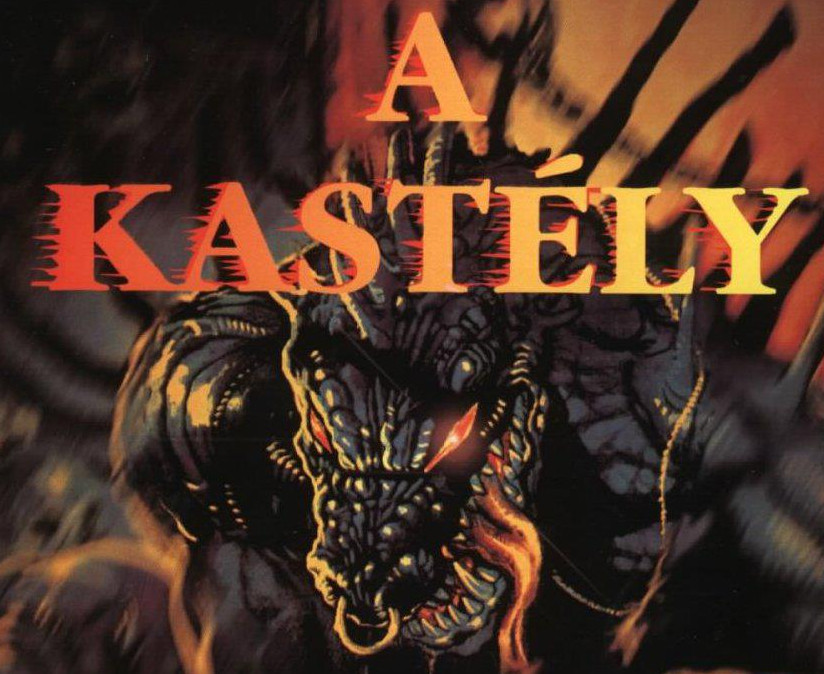
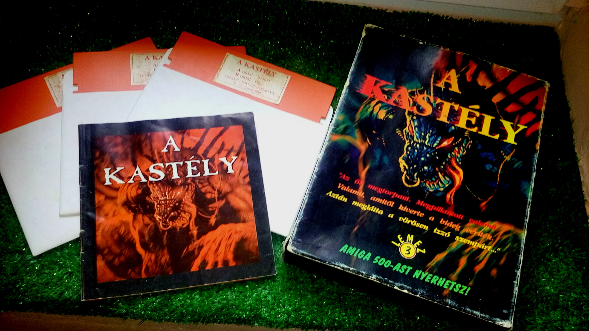
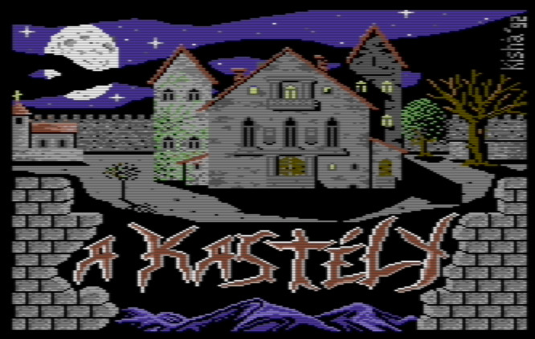
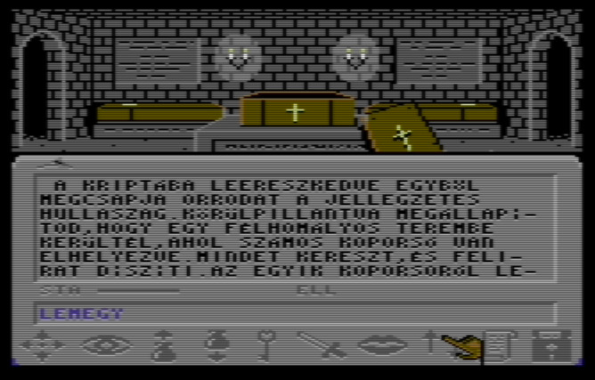
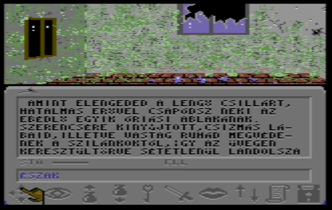
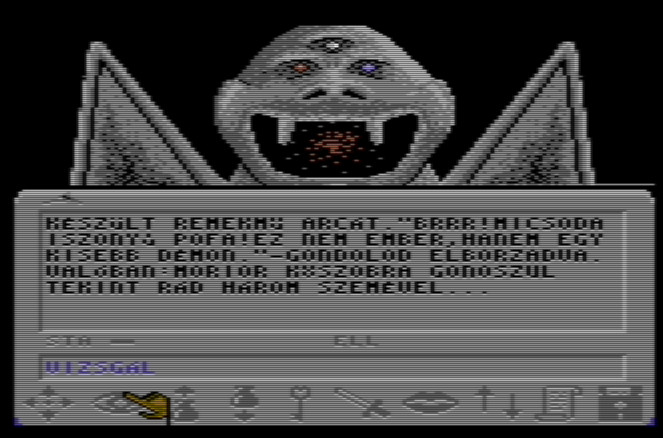
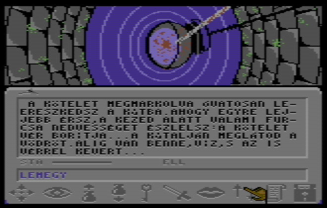
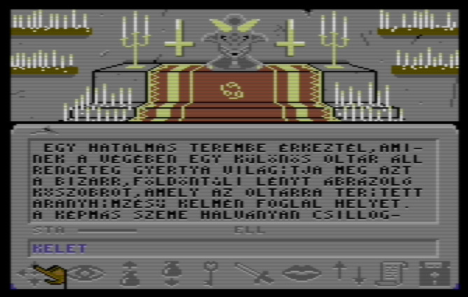

# A Kastély - végigjátszás

A Kastély c. kalandjáték egy magyar fejleszőtcsapat (Mantis Software) műve, Commodore 64-re jelent meg az 576KByte gondozásában, 1993-ban. Ebben az időben a játékfejlesztők már főként Amigára, de még inkább PC-re fejlesztettek játékokat, miközben itthon, Magyarországon még rengeteg aktív C64 tulajdonos maradt, akik nem voltak hajlandóak feláldozni szeretett gépüket a csili-vili grafika és pompás hangzás oltárán. Őket célozta meg a Kastély, majd később a Long Life és a Newcomer is. Igazán újszerű volt akkoriban egy teljes egészében magyar nyelvű, igényesen kivitelezett kalandjáték, ráadásul díszdobozban, komplett kézikönyvvel ellátva.

A játékot körüllengő misztikus légkört jól szemlélteti, hogy urban legendák terjengtek arról, hogy a játék teljesen 3D-s, és hogy majd találunk egy szakácsot hátba szúrva. Ezekből persze semmi nem volt igaz, de motiválóan hatott arra, hogy beszerezzük. Olyan 8-10 éves lehettem, amikor először meghallottam a játék zenéjét, sötétben ülve. Mélyreható élmény volt.

Írásomban összefoglalom, hogy hogyan lehet végigjátszani a játékot. Ennek két módja is van attól függően, hogy milyen karaktert választottunk a kezdőképernyön. Ebből az egyik mód még megoldásra vár, úgyhogy játékos kedvű retro kalandorok, segítsetek megtalálni a megoldást. Az 576KByte leközölt egy - a készítők által írt - végigjátszást, ami tartalmazta a Kastély részletes megoldását a harcos és a tolvaj karakterhez, egy előzetesben pedig általános tippeket közölt, amiben megemlíti, hogy a varázsolni tudó karakterekkel valamiféle varázsszertartással lehet megölni a démont.

Ami azt illeti, van egy igen gyors és elegáns végigjátszása is a játéknak, amiről [egy videóból][kastely-video] értesültem. Nem adok lépésről lépésre történő leírást, ehelyett inkább fordított logikával élve, a végcéltól visszafelé haladva végigkövetem, hogy hogyan lehet túljutni az egyes akadályokon, így az is érthető lesz, mit miért csinálunk. A játék célja a démon megölése, amihez be kell jutnunk a szobájába, ennek viszont két akadálya is van. Egyrészt egy vámpír, akit semmi esélyünk szemtől szemben megölni, és ha ez nem lenne elég, egy vasrács is utunkat állja. A vámpír megöléséhez a templomkertben lévő kriptába kell lemennünk, oda bejutni viszont csak úgy tudunk, ha előbb a kovácsműhelyből elcsenjük a vasrudat, amivel fel tudjuk feszíteni a fogantyút.

Amint lent vagyunk a kriptában, tegyük le a kamrából szerzett fokhagymát, és az istállóból szerzett karót döfjük a vámpír szívébe. Az istállóba való bejutáshoz le kell szerelni a fő őrt, de ha a gazdatiszttől előbb elvesszük a medált (a tolvajjal ellopni, a pappal és varázslóval beszélgetéssel elkérni is lehet), akkor a medált a fő őrnek adva tovább fog engedni. Mindezek után menjünk fel az első emeleti dolgozó szobába (a fa lépcsőtől keletre), és hozzuk működésbe az itt található kapcsolót, ezzel kinyitottuk a vasrácsot. Ezzel szabad az út a démonhoz, menjünk fel a második emelet északkeleti sarkába, be a mágia laborba, majd tovább a rituálék termébe, ahol a gonosz démon már várja, hogy lekaszaboljuk.

Ennél persze sokkal több rejlik a játékban. Érdemes minél hamarabb összeszedni az összes kulcsot, így nem maradhat zár nyitatlanul előttünk. A vaskulcsot (ezt fogjuk leggyakrabban használni) az északi bástya tetején üldögélő beszédes hulla zsebéből, az álkulcsot pedig az első emeleti folyosón egy vázából tudjuk megszerezni, de ezekkel a tolvaj már kezdéskor rendelkezik. A kiskulcs az első emeleten, a hullákkal tömött szobában (könnyű felismerni), egy fiókban lelhető fel, az ezüst kulcsot pedig az emelet északkeleti részén lévő szobában, amelyikben egy sebesülttel találkozhatunk. Találtam egy rézkulcsot is a második emeleti "kígyós" szobában, de nem találtam olyan zárat, amit ez a kulcs nyitna, úgyhogy ez a rejtély is megoldásra vár.

Ezen kívül érdemes mindenkit alaposan kikérdezni, akivel szembe kerülünk. A játék története ezeken a beszélgetéseken keresztül bontakozik ki - persze előbb érdemes a kézikönyvben található novellát elolvasni. Ahhoz, hogy a papot szórabírjuk, adjuk neki a kezdő helyszínen a földön talált gyűrűt. Jyn Gradasht, a prellananosi csendőrt (ugye elolvastátok a játékhoz mellékelt novellát?) is érdemes kikérdezni, és csak azután megölni. A grófot pedig a kiskulccsal lehet kiszabadítani az első emeleti szobájából, amit érdemes is megtenni, mert tőle is érdekes infókat tudhatunk meg.

Említésre méltó még, hogy bizonyos helyszínek csak bizonyos karakterekkel érhetők el. A kézikönyben is látható, vérrel szennyezett kútfenékhez például csak varázshasználóval juthatunk le. A tolvaj ügyes trükkje pedig, hogy agilitásának köszönhetően a vámpírtól szerzett köpennyel levitorlázhat a kastély erkélyéről a bejárat elé. Ezen kívül a grófot is egészen egyedi módon szabadíthatja ki. A tolvajjal játszva ugyanis az első emeleti korlátról elrugaszkodva, a csilláron átlendülve az ablakon keresztül átugorhatunk a sufni tetejére, és onnan bemászhatunk az ablakon. Persze az ajtón lévő lakat a szobán kívül van, úgyhogy ha nem vagyunk óvatosak, életünk végéig cseverészhetünk a gróffal, mert az eredeti útvonalon már nem mehetünk vissza.

Kis hatásvadászattal élve, a játék leghátborzongatóbb része a pince, amelynek van egy titkos, elfalazott része is. Ide a földszinti lovagterem déli részén lévő falikart meghúzva, majd a feltáruló átjárón leereszkedve juthatunk el. A pince titkos járataiban meglátogathatjuk Morior, Az Irgalmatlan szobrát. A gazdatiszt ládájában talált kötéllel fel is mászhatunk rá, és ellophatjuk a szemei helyén található ékköveket, amivel elvileg meggyengítjük a démont. A másik módja, hogy javítsunk az esélyeinken a démon ellen, ha a tőrt használjuk fegyverként ellene. Ezt könnyűszerrel megszerezhetjük, ha fogjuk a pincelejáratban talált ásót, és a kertész tanácsát követve elkezdünk ásni az öreg fa alatt (egy varázshasználó karakterrel játszva egész más történik, lásd lentebb). A tőrt viszont használat előtt ki kell élezni a sufniban, hisz még egy ilyen remek fegyvert is kikezd az idő, ha évekig a föld alatt hagyják.

A varázshasználó karakterekkel választhatjuk a harcias utat a végigjátszáshoz, de sok helyszínen találunk arra utalást, hogy varázsszertartással is meg lehet ölni a démont. Varázshasználóval játszva megszerezhetjük az aranylapot a kúrban talált kéz markából, amit az első emeleti "vastagrácsos" szobában a bal oldali oszlop "slotjában beinzertálhatjuk", és megnyílik az út a szentély felé. Bár ez nagyon érdekes hely, én nem találtam semmi használhatót bent, ugyanakkor meghalok, ha ki akarok menni. Az 576-ban volt egy tipp erre, elvileg le kell tenni valami tárgyat, de én mindig meghaltam, pedig az összes általam ismert tárggyal kipróbáltam... egyenként...

A másik érdekesség, hogy ha varázshasználóval ásunk a fa alatt, akkor a tőr helyett egy olyan üzenet fogad minket, hogy rajzoltunk egy pentagrammát a talajba. Gondolom, hogy ez lenne az első lépése a varázsszertartásnak, de nem sikerült rájönnöm, hogy mi a következő. Ami azt illeti, régebbi végigjátszásaimból emlékszem arra, hogy valahol a kastélyban találtam egy könyvet (naplót?), amiből ki volt tépve egy lap. Sejtésem szerint Gradash ebből tépte ki azt a papírlapot, amit nála találunk, ha megöljük, és amin a pentagrammára való utalást olvashatjuk. Azonban most játszva nem találtam meg ezt a könyvet, de ha sikerülne (már ha egyáltalán jól emlékszek), akkor azt a könyvlappal együtt használva talán kaphatnánk egy újabb nyomot a varázsszertartáshoz. Levélben megkérdeztem a sztori íróját, Herédi Attilát, hátha ő emlékszik a varázshasználóval való végigjátszásra, de sajnos ő sem tudott segíteni. Fórumokon sem találam semmilyen használható infót, úgyhogy most az internet népéhez fordulok, tegyük teljessé a leírást, segítsetek rájönni, mi a megoldás!

Végezetül álljon itt egy hasznos lista azoknak, akiknek nincs meg a játékhoz mellékelt novella, mégis szeretnének játszani a játékkal. A másolásvédelmet ugyanis úgy oldották meg, hogy a játék bizonyos pontjain rákérdez valamelyik szóra a kézikönyvből. A megkérdezett szavak köre azonban viszonylag szűk, úgyhogy összegyűjtöttem azokat a kérdéseket és válaszul adandó szavakat, amikkel a játék során találkoztam.

[kastely-video]: https://www.youtube.com/watch?v=ettPyaCXVR0
